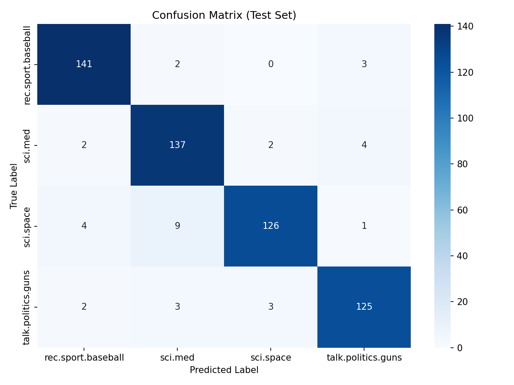
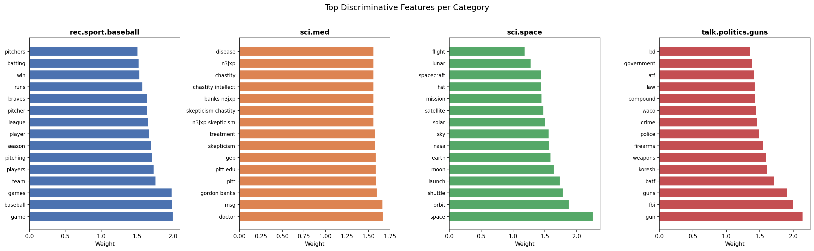
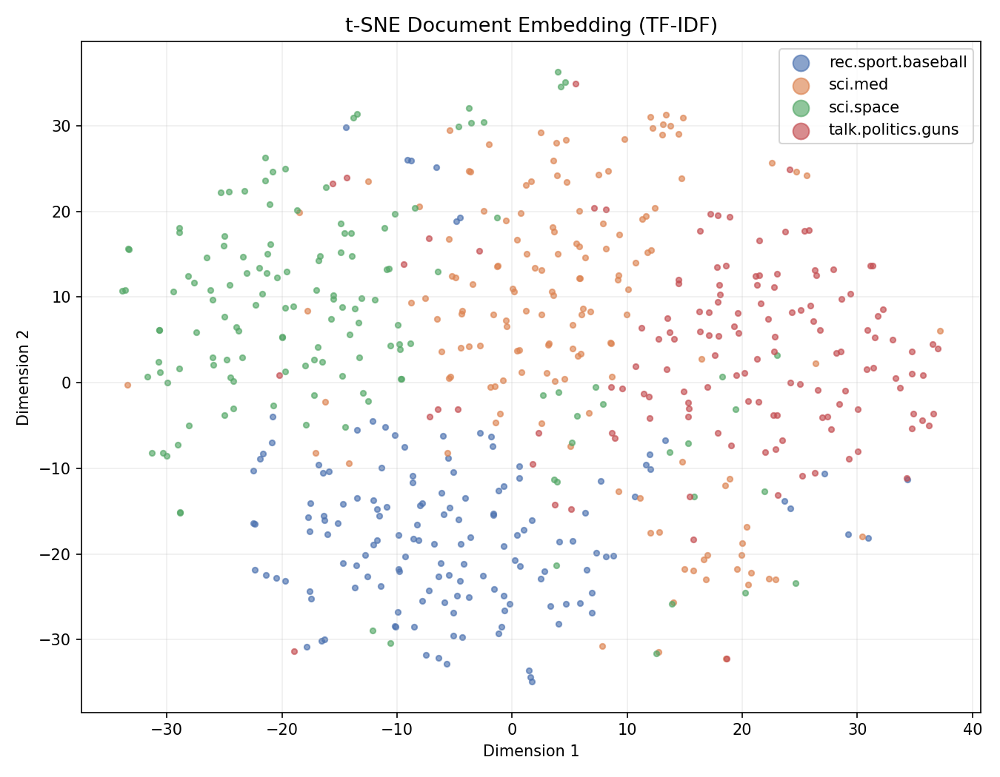
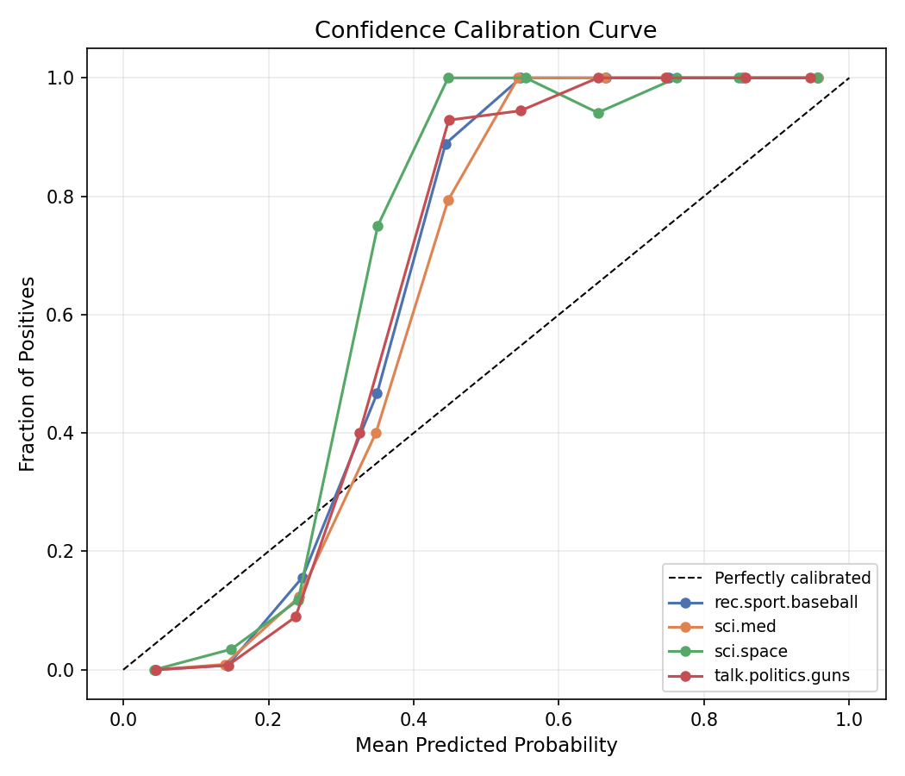
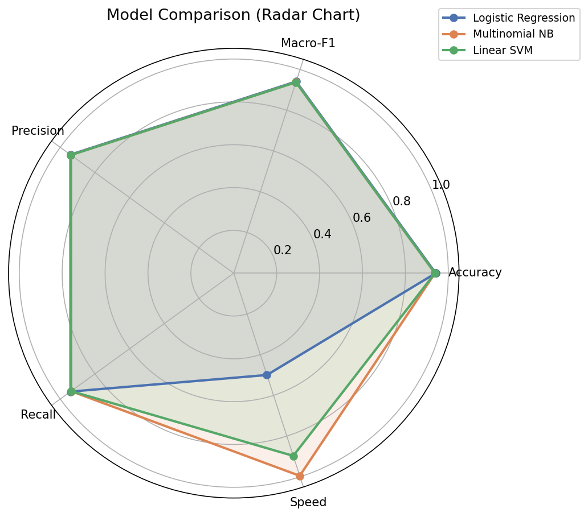
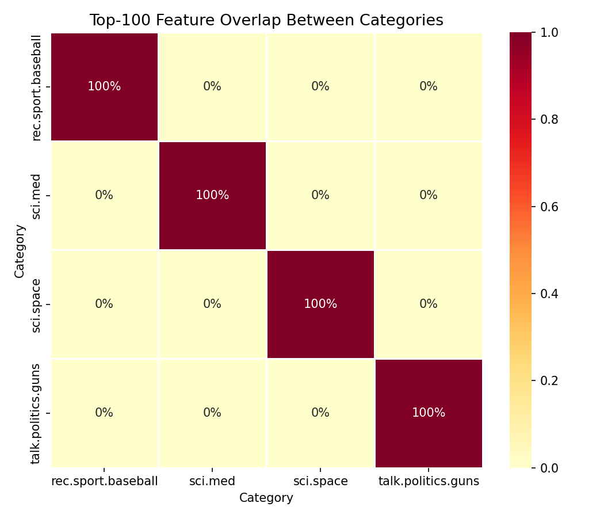

# Newsgroup Text Classifier

Text classification on the **20 Newsgroups** dataset using TF-IDF features and classical ML models (Logistic Regression, Naive Bayes, Linear SVM).

## Dataset

Uses a 4-class subset of the [20 Newsgroups](http://qwone.com/~jason/20Newsgroups/) corpus (built into scikit-learn):
- `sci.med`, `sci.space`, `rec.sport.baseball`, `talk.politics.guns`
- ~3,500 samples total, split 70/15/15 (train/val/test) with stratification
- Headers, footers, and quotes removed to prevent metadata leakage

## Approach

1. **Preprocessing**: lowercase, remove near-empty docs, TF-IDF vectorization (fit on train only to avoid data leakage)
2. **Model selection**: compare Logistic Regression, Multinomial NB, Linear SVM on validation macro-F1
3. **Evaluation**: confusion matrix, per-class precision/recall, concrete error analysis with feature attribution
4. **Explainability**: t-SNE embeddings, confidence calibration, per-class feature importance, model comparison radar chart, and feature overlap analysis

## Reproducibility

- All random seeds fixed (`SEED=42`, numpy, sklearn, `PYTHONHASHSEED`)
- Deterministic train/val/test split via `stratify` + `random_state`
- Experiment logs saved as JSON in `outputs/logs/`

## Usage

```bash
pip install -r requirements.txt

# Train (compares 3 models, saves best checkpoint)
python -m src.train --lr 1.0 --max_features 10000 --ngram_max 2

# Evaluate on test set (confusion matrix + learning curve + error analysis)
python -m src.evaluate

# Predict on custom text
python -m src.predict "NASA launched a new satellite into orbit"

# Predict with built-in examples (one per category)
python -m src.predict

# Interactive prediction mode
python -m src.predict --interactive

# Generate explainability dashboard (all 5 visualisations)
python -m src.explainability

# Generate only the t-SNE embedding plot
python -m src.explainability --tsne_only

# Run unit tests
python -m pytest tests/ -v
```

## Project Structure

```
newsgroup-text-classifier/
├── src/                          # Source code
│   ├── __init__.py
│   ├── preprocess.py             # Data loading, cleaning, TF-IDF vectorization
│   ├── train.py                  # Training loop with model comparison
│   ├── evaluate.py               # Test evaluation, confusion matrix, learning curve, error analysis
│   ├── predict.py                # Interactive prediction CLI with confidence scores
│   └── explainability.py         # Model interpretability dashboard (t-SNE, calibration, radar chart)
├── tests/                        # Unit tests
│   ├── test_data.py              # Tests for data pipeline integrity
│   ├── test_predict.py           # Tests for prediction module
│   └── test_explainability.py    # Tests for explainability module
├── outputs/                      # Generated artifacts
│   ├── checkpoints/              # Saved model checkpoints (.joblib)
│   ├── logs/                     # Experiment logs (JSON)
│   └── figures/                  # Plots (confusion matrix, learning curve, explainability)
├── requirements.txt              # Python dependencies (pip)
├── README.md
└── .gitignore
```

## Results

Best model: **Multinomial Naive Bayes** (selected by validation macro-F1)

| Metric | Validation | Test |
|--------|-----------|------|
| Accuracy | 93.56% | 93.79% |
| Macro F1 | 0.9352 | 0.9378 |

Train-test accuracy gap: 4.1% (no significant overfitting).

Top confusion pair: `sci.space → sci.med` (9 errors) — both categories share medical/scientific vocabulary.

### Confusion Matrix



### Prediction Example

```
$ python -m src.predict "NASA launched a new satellite into orbit around Mars"

  Input:      nasa launched a new satellite into orbit around mars
  Prediction: sci.space
  Confidence: 97.2%
  Class probabilities:
    sci.space                 0.972 #############################
    sci.med                   0.016
    rec.sport.baseball        0.007
    talk.politics.guns        0.005
```

## Explainability Dashboard

Run `python -m src.explainability` to generate the full interpretability suite.

### Per-Class Feature Importance

Shows the top discriminative words for each category — revealing *what* the model actually learns.



### t-SNE Document Embedding

Projects 10,000-dimensional TF-IDF vectors onto 2-D, revealing how documents naturally cluster by topic.



### Confidence Calibration Curve

Reliability diagram comparing the model's predicted probability against actual accuracy — measures whether the model's confidence can be *trusted*.



### Model Comparison Radar Chart

Compares Logistic Regression, Naive Bayes, and Linear SVM across accuracy, F1, precision, recall, and speed simultaneously.



### Feature Overlap Heatmap

Shows vocabulary similarity between categories — high overlap explains *why* certain category pairs are confused more often.



## Environment

- Python 3.10+
- pip (see `requirements.txt`)
- CPU only (no GPU required)
